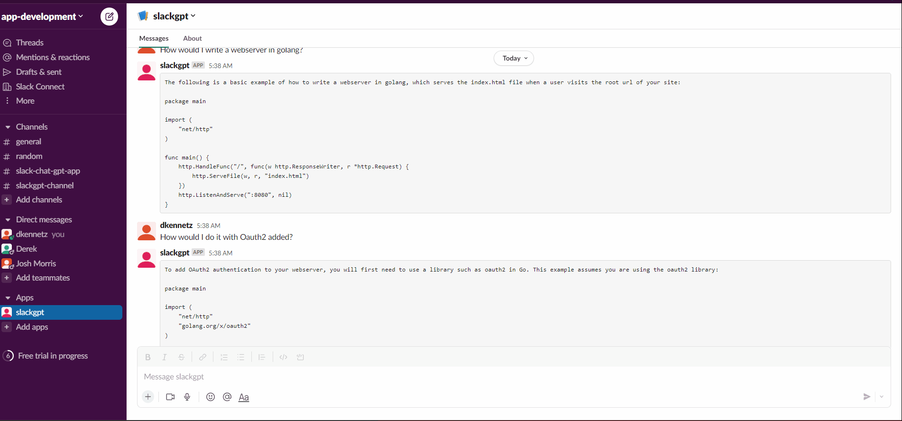
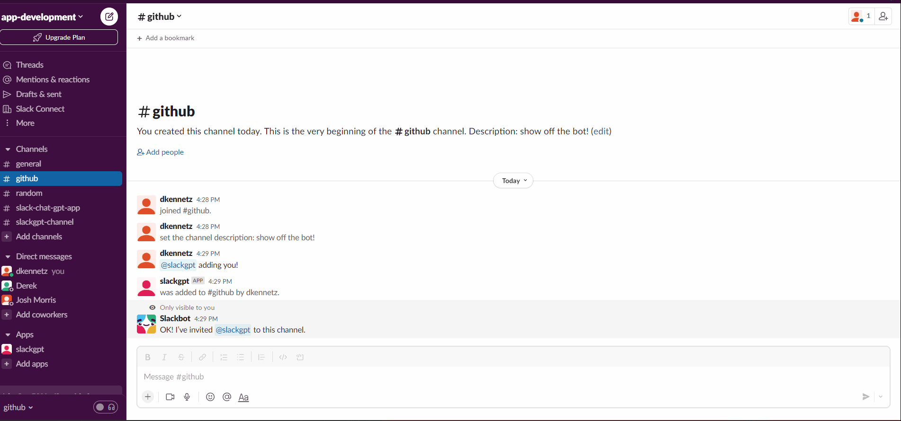

<h1 align="center">slackgpt</h1>
<p align="center">
   <a href='#GoVersion'>
      
   </a>
    <a href="https://github.com/drkennetz/go-slack-chat-gpt3">
        
    </a>
    <a href="https://codecov.io/github/drkennetz/go-slack-chat-gpt3" > 
         
    </a>
    <a href="https://github.com/drkennetz/go-slack-chat-gpt3/issues">
        
   </a>
</p>

slackgot is a simple slack bot server which handles DM's and app mention events, sending the event to chat-gpt and responding to the channel with chat-gpt's response.

slackgpt can respond to both direct messages, or threads in a channel. It can handle multiple conversations concurrently, enabling parallel conversations to happen simultaneously in channels it has been added to.

## Table of Contents
- [Quick Start](#Quick-Start)
- [Bot Setup](./example/walkthrough.md)
- [DM Example](#DMS)
- [Thread Example](#Threads)
- [Contributing](#Contributing)
- [Open an Issue](#Issues)
- [Code of Conduct](#Code-of-Conduct)


## Quick Start
Build the binary, add tokens to config, and run!

### Build
```bash
# requires >= go 1.18 to build from source
git clone https://github.com/drkennetz/slackgpt.git
cd slackgpt && go build -o ./bin/slackgpt
```

### Config

For a more thorough walk-through of setting up the bot and getting tokens, visit [this detailed doc](./example/walkthrough.md).
```
CGPT_API_KEY=sk-...z7
SLACK_APP_TOKEN=xapp-1-...47
SLACK_BOT_TOKEN=xoxb-...S0
```

### Run

#### Help
```bash
This program is a slack bot that sends mentions to chat-gpt and responds with chat-gpt result

VERSION: development

Usage: slackgpt --config CONFIG [--type TYPE] [--debug]

Options:
  --config CONFIG, -c CONFIG
                         config file with slack app+bot tokens, chat-gpt API token
  --type TYPE, -t TYPE   the config type [json, toml, yaml, hcl, ini, env, properties]; if not passed, inferred from file ext
  --debug                set debug mode for client logging
  --help, -h             display this help and exit
  --version              display version and exit
```
#### Run
```
./bin/slackgpt -c ./config.env [-t config type] [--debug]
2023/02/01 14:53:19 Config values parsed
socketmode: 2023/02/01 14:53:19 socket_mode_managed_conn.go:258: Starting SocketMode
2023/02/01 14:53:19 Connecting to Slack with Socket Mode...
...
```

## DMS
<details>
  <summary>Conversation in DM's</summary>
  
</details>

## Threads
<details>
  <summary>Conversation in threads</summary>
  
</details>

## Contributing
Please follow the [Contribution File](./Contribution.md) to contribute to this repo.

## Issues
To submit an issue, select the issue template that most closely 
corresponds with your issue type and submit. Someone will get to you soon!

## Code of Conduct
Please note that go-slack-chat-gpt3 has a [Code of Conduct](./CODE_OF_CONDUCT.md).
By participating in this community, you agree to abide by its rules. 
Failure to abide will result in warning and potentially expulsion from this community.
