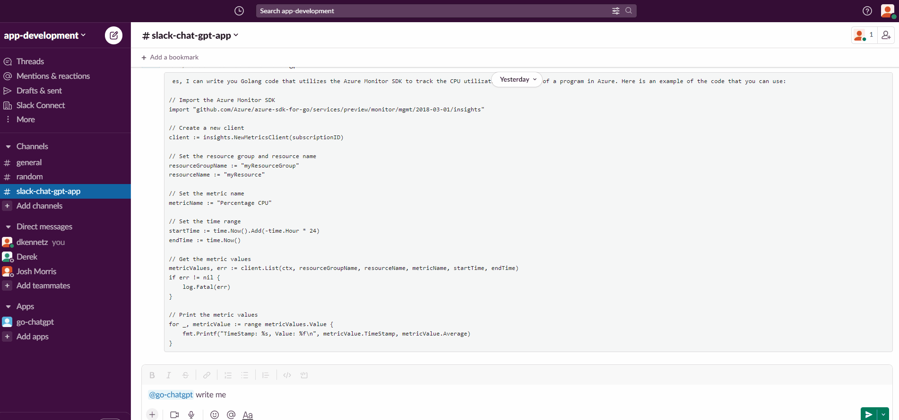

# go-slack-chat-gpt
go-slack-chat-gpt is a simple slack bot server which handles [slack app mention events](https://api.slack.com/events/app_mention), sending the event to chat-gpt and responding to the channel with chat-gpt's response.


## Table of Contents
- [Quick Start](#Quick-Start)
- [Contributing](#Contributing)
- [Open an Issue](#Issues)
- [Setup](#Setup)


## Quick Start
Build the binary, add tokens to config, and run!

### Config
The config must contain three entries separated by an equals (=) sign. Two are required by slack, and one is required by chat-gpt.

A walk through of getting a chat-gpt token, setting up a slack bot and giving it proper permissions, and getting tokens will be discussed in detail further down the README. This section will just ensure that you build the tool and have it functional on the CLI.
```
CGPT_API_KEY=sk-...z7
SLACK_APP_TOKEN=xapp-1-...47
SLACK_BOT_TOKEN=xoxb-...S0
```
Note: All slack app tokens start with `xapp` and all slack bot tokens start with `xoxb`. 
```bash
# build
go build -o ./bin/slackgpt

# run help
./bin/slackgpt -h
This program is a slack bot that sends mentions to chat-gpt and responds with chat-gpt result

VERSION: development

Usage: slackgpt --config CONFIG

Options:
  --config CONFIG, -c CONFIG
                         config file with slack app+bot tokens, chat-gpt API token
  --help, -h             display this help and exit
  --version              display version and exit

# and run prog with proper config + tokens
./bin/slackgpt -c ./.env 
2023/02/01 14:53:19 Config values parsed
socketmode: 2023/02/01 14:53:19 socket_mode_managed_conn.go:258: Starting SocketMode
2023/02/01 14:53:19 Connecting to Slack with Socket Mode...
...
```

## Contributing
pass

## Issues
issues

# Setup
add non-default path for config file


