# Setup
In order to run the slackgpt app, you need a chat-gpt api key, a slack bot with correct OAuth permissions and a bot token, and a slack app token.
While the chat-gpt api key is fairly straightforward, the slack bot is a bit more challenging so
a walk-through will be included below.

The config is parsed by [viper](https://github.com/spf13/viper) and must conform to the [viper supported config types](https://github.com/spf13/viper#reading-config-files).

## Chat-GPT API Key
For the chat-gpt API key, sign up for an account and copy the key: https://platform.openai.com/account/api-keys.
Once you have this key, add it to your config file as:
```CGPT_API_KEY=<mykey>```

## Slack App Creation
1. Sign into the workspace for which you want to create the application for
2. Go to api.slack.com and click "Create an App"

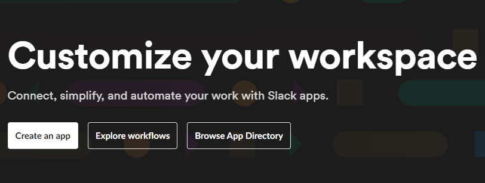
3. A pop-up will appear asking if you'd like to create from scratch, or from a manifest. Click "From scratch".
4. Give the app a name. Mine will be called "slackgpt".
5. Select the correct workspace. Mine is called "app-development".
6. Click Create App

## Setting up app
1. If you've done the above, you will be taken to the Basic Information page of your app.
2. From here, click the "Socket Mode" tab under "Settings" in the left panel.


3. Click the button to "Enable Socket Mode"


4. Under "Connect using Socket Mode", click "App Level Token".
5. Click the "Add features and functionality" dropdown and click "Event Subscriptions".


6. This will take you to a page that will allow you to "Enable Events". Click it to "On".
7. This will trigger some options. Click the "Subscribe to bot events" dropdown and click "Add Bot User Event".

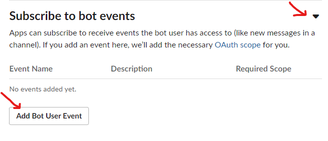

8. Select "app_mention" and "message.im". This will enable your bot to access mentions of your bot, and set your bot up to view direct message events. Your bot events section should now look like this:

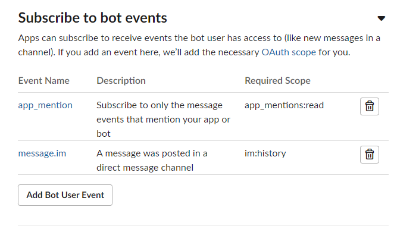

9. Then, we must save changes - click the "Save Changes" button on the bottom right.
10. On the left sidebar under "Features", navigate to "OAuth & Permissions".
11. Scroll down the page to "Scopes", where you should already have "app_mentions:read" and "im:history" scope applied under "Bot Token Scopes" from setting up the events.

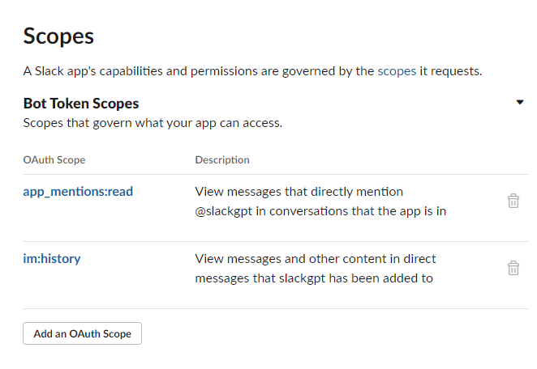

12. We need to add "chat:write", "im:read", "im:write",  as a scope - so select that and your new Bot Token Scopes should look like this:

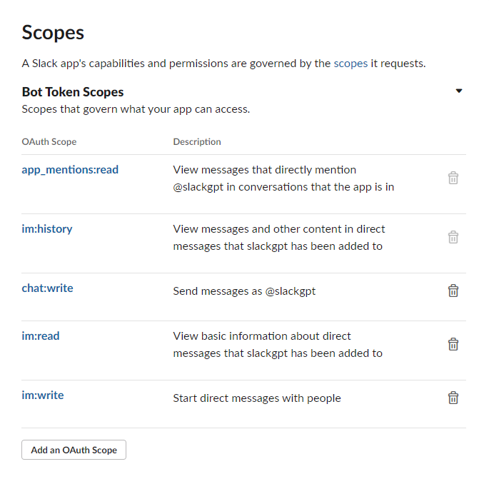

13. **Skip to step 15 if you do not want users to be able to dm your app.** Next, we need to allow out App to send and receive direct messages. On the left side under "Features", click "App Home". Scroll down to see the "Messages Tab":


14. We need to click this and check the box under that tab to allow users to send direct messages to our App. 

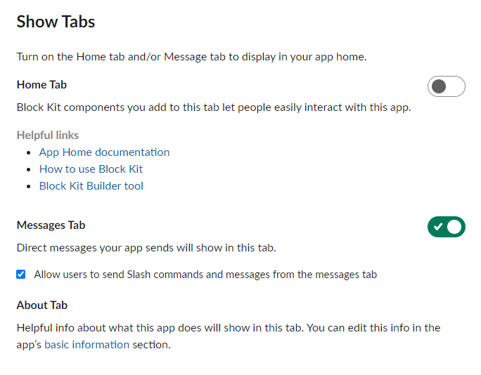

15. Finally, we need to collect our 2 tokens. Scroll up and click the OAuth page, find and click "Install to Workspace". If you are an admin, this will happen automatically. If not, it will send a request.

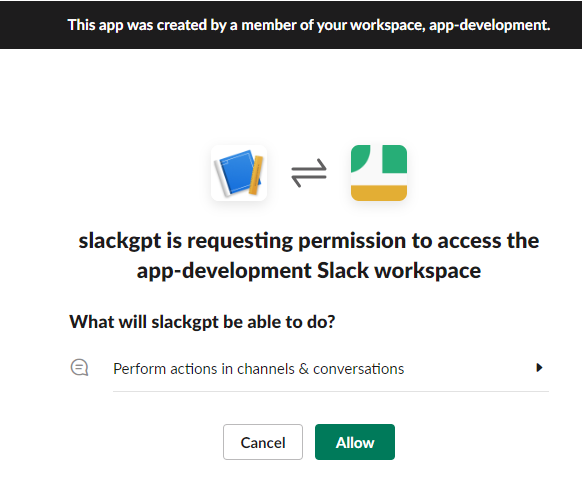

16. Once it is installed, you will be redirected back to OAuth, where you will see a bot token.
17. Copy that token starting with `xoxb-` to your config file under the key: ```SLACK_BOT_TOKEN=<bot token>```
18. Finally, go back to "Basic Information" on the left sidebar and scroll down past "App Credentials" to "App-Level Tokens".


19. Create one by clicking "Generate Token and Scopes". **Note**: Unlike your bot token, you will not be able to see this text again after you leave, so be sure to copy right away!
20. A pop-up will ask for a token name and a scope. Name your token, and add the scope "connections:write".

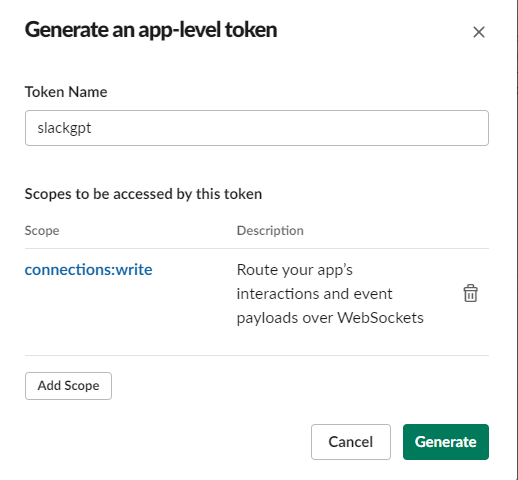

21. Click "Generate", and copy the token starting with `xapp-` to your config file under the key: ```SLACK_APP_TOKEN=```.

22. This is it! Once you've made it here, you should have a config file with the following key=value fields:
```
CGPT_API_KEY=<value>
SLACK_BOT_TOKEN=xoxb-...
SLACK_APP_TOKEN=xapp-...
```

23. Now go to your slack workspace, and either add the app to the existing channel, or create a new channel to add the app to.

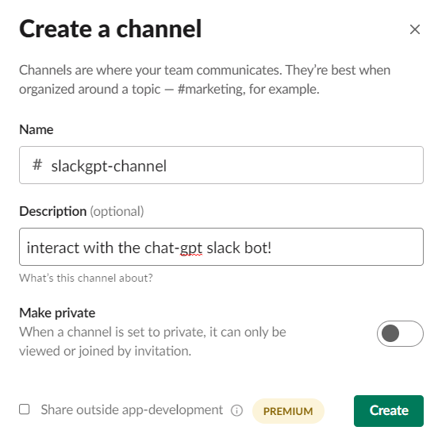

24. Add people, or you can skip, but we need to add the app. We can do this by directly mentioning the app's handle. The app's handle will be what you named the app in the beginning. Mine was `slackgpt`

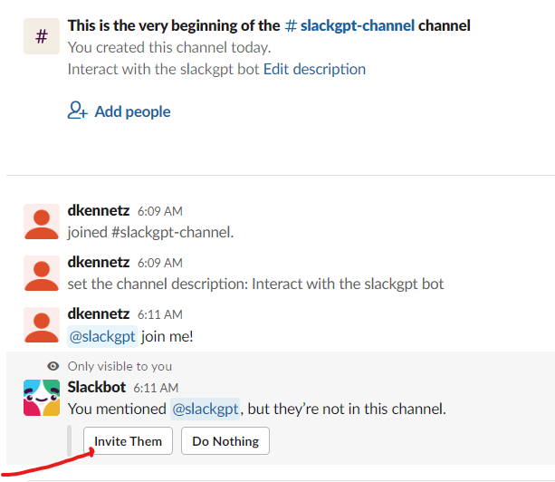

25. Now that they are added to the channel, and you have your config with your tokens, build and run the app as seen in the Quick Start section at the top:

```
go build -o ./bin/slackgpt

## config.txt is my config
## Note, the filename must end in .env to use the config format above
./bin/slackgpt -c ./config.env

socketmode: 2023/02/02 20:14:28 socket_mode_managed_conn.go:258: Starting SocketMode
2023/02/02 20:14:28 Connecting to Slack with Socket Mode...
api: 2023/02/02 20:14:28 socket_mode.go:30: ...
...
```

26. Try out in slack:


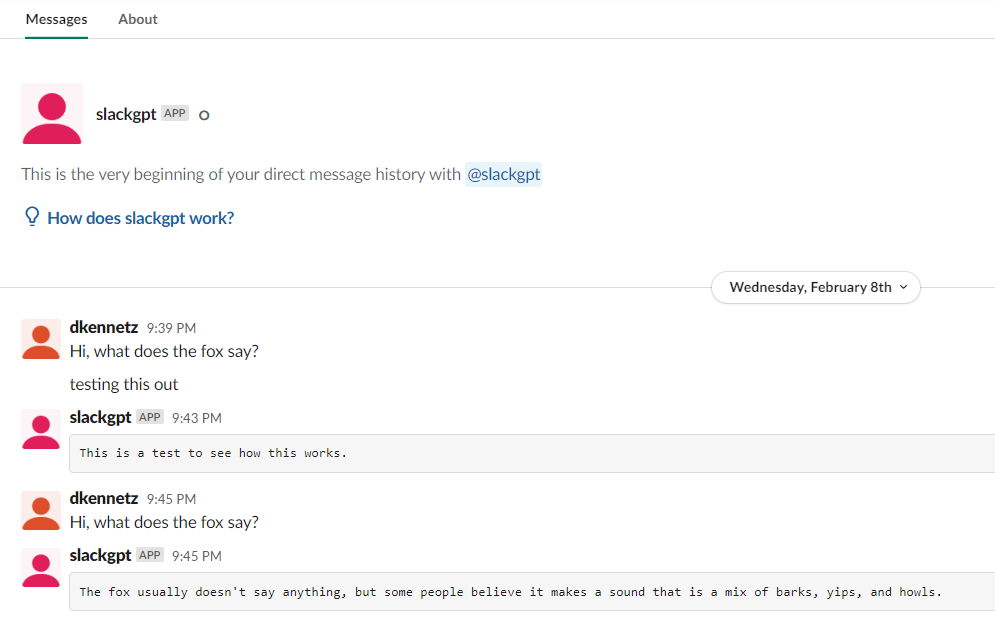